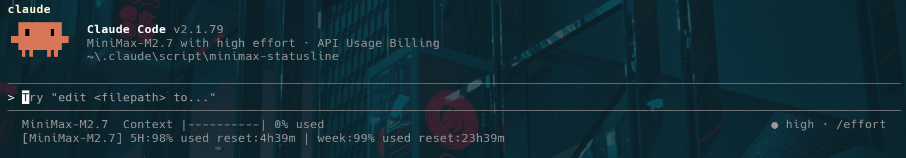
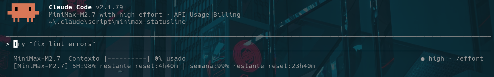

# MiniMax Statusline

<!-- ENGLISH -->
Display **MiniMax Coding Plan** token usage directly in your **Claude Code** statusline.

Shows in real time:
- **Conversation context** (context window usage)
- **5-hour cycle** (% used and time to reset)
- **Weekly cycle** (% used and time to reset)



## Requirements

- Python 3.10+
- [MiniMax Open Platform](https://platform.minimax.io) API key
- Claude Code CLI

## Installation

### 1. Clone the repository

```bash
git clone https://github.com/juninhosal/minimax-claude-statusline.git
cd minimax-claude-statusline
```

### 2. Create the `.env` file

Copy the example and add your API key:

```bash
cp .env.example .env
```

Edit `.env`:
```env
MINIMAX_API_KEY=your_api_key_here
```

### 3. Install the package

```bash
pip install .
```

> Also works with `pip install -e .` for development mode installation.

## Usage

### Check usage manually

```bash
# Uses default model (MiniMax-M2.7)
minimax-statusline

# Specify a model
minimax-statusline MiniMax-M2.5

# Or via environment variable
MINIMAX_MODEL=MiniMax-M2.7 minimax-statusline
```

Output:
```
[MiniMax-M2.7] 5H:8% used reset:2h30m | week:1% used reset:26h30m
```

## Claude Code (Statusline) Integration

After installing the package, configure the statusline in Claude Code's settings file.

### Configuration file

Edit `C:\Users\YOUR_USER\.claude\settings.json`:

```json
{
  "env": {
    "ANTHROPIC_BASE_URL": "https://api.minimax.io/anthropic",
    "ANTHROPIC_AUTH_TOKEN": "your_token_here",
    "ANTHROPIC_MODEL": "MiniMax-M2.7",
    "MINIMAX_API_KEY": "your_api_key_here",
    "MINIMAX_MODEL": "MiniMax-M2.7"
  },
  "statusLine": {
    "type": "command",
    "command": "python -m minimax_statusline.statusline"
  }
}
```

### What the statusline shows

Line 1: Claude Code conversation context
```
MiniMax-M2.7  Context |######----| 65% used
```

Line 2: MiniMax plan usage
```
[MiniMax-M2.7] 5H:8% used reset:2h30m | week:1% used reset:26h30m
```

### Fields

| Field | Description |
|-------|-------------|
| `5H` | Percentage used in the rolling 5-hour cycle |
| `reset` | Time remaining until 5h cycle resets |
| `week` | Percentage used in the weekly cycle |
| `reset` | Time remaining until weekly reset |
| `Context` | Percentage of context window used in current conversation |

## Important: MiniMax only works on Claude Code CLI

This project is designed specifically for the **Claude Code CLI** (command-line interface).

MiniMax **does not work** on Claude Web, Claude Desktop, or any web/APP interface. This is because:

1. The `ANTHROPIC_BASE_URL` variable must point to MiniMax's API (`https://api.minimax.io/anthropic`)
2. Authentication via `ANTHROPIC_AUTH_TOKEN` uses MiniMax's API key
3. Claude Code allows configuring a custom `ANTHROPIC_BASE_URL`, unlike Claude Web/Desktop

**Compatibility:**
- [x] Claude Code CLI (Linux, macOS, Windows)
- [ ] Claude Web (does not support custom API base URL)
- [ ] Claude Desktop (does not support custom API base URL)

## How the MiniMax API Works

### Getting your API Key

1. Go to [MiniMax Open Platform](https://platform.minimax.io)
2. Navigate to **Account Management > API Keys**
3. Create a new key (choose the type according to your plan)

### Endpoint used

```
GET https://api.minimax.io/v1/api/openplatform/coding_plan/remains
Authorization: Bearer <MINIMAX_API_KEY>
```

### MiniMax Plans

| Plan | Description |
|-------|-------------|
| **Pay-as-you-go** | Charged by actual token usage. Key: `Secret Key` |
| **Coding Plan** | Monthly/weekly token limit. Key: `Coding Plan Key` |

This project works with both. The `/coding_plan/remains` endpoint returns Coding Plan data.

### Supported models

Token plans are shared across all text models:

- `MiniMax-M2`
- `MiniMax-M2.1`
- `MiniMax-M2.5`
- `MiniMax-M2.7`
- `speech-2.8-hd`, `speech-2.8-turbo`, etc.
- `music-2.0`, `music-2.5+`, etc.
- `MiniMax-Hailuo-02-*` (video)
- `image-01`, `image-01-live`

The script filters by the model you are currently using.

## API Response Format

```json
{
  "model_remains": [{
    "model_name": "MiniMax-M2.7",
    "current_interval_total_count": 1500,
    "current_interval_usage_count": 1381,
    "remains_time": 7200000,
    "current_weekly_total_count": 52500,
    "current_weekly_usage_count": 52000,
    "weekly_remains_time": 90000000
  }],
  "base_resp": { "status_code": 0, "status_msg": "success" }
}
```

| Field | Description |
|-------|-------------|
| `current_interval_total_count` | Total tokens in 5h cycle |
| `current_interval_usage_count` | Tokens already used in 5h cycle |
| `remains_time` | Milliseconds until 5h cycle resets |
| `current_weekly_total_count` | Total tokens in weekly cycle |
| `current_weekly_usage_count` | Tokens already used this week |
| `weekly_remains_time` | Milliseconds until weekly reset |

## Tips

### Debugging authentication issues

```bash
# Direct curl test
curl -X GET "https://api.minimax.io/v1/api/openplatform/coding_plan/remains" \
  -H "Authorization: Bearer $MINIMAX_API_KEY" \
  -H "Content-Type: application/json"
```

If you receive `{"base_resp":{"status_code":1004,"status_msg":"cookie is missing, log in again"}}`, your API key may be a **Coding Plan Key** that requires browser login. Use a **Secret Key** for pure API key authentication.

### View all available models

```bash
minimax-statusline 2>&1 | grep "Modelos disponiveis"
```

---

<!-- PORTUGUESE -->
Exibe o uso de tokens do **MiniMax Coding Plan** diretamente na statusline do **Claude Code**.



Mostra em tempo real:
- **Contexto da conversa** (uso do context window)
- **Ciclo de 5 horas** (% usado e tempo para reset)
- **Ciclo semanal** (% usado e tempo para reset)

## Requisitos

- Python 3.10+
- Chave de API do [MiniMax Open Platform](https://platform.minimax.io)
- Claude Code CLI

## Instalacao

### 1. Clone o repositorio

```bash
git clone https://github.com/juninhosal/minimax-claude-statusline.git
cd minimax-claude-statusline
```

### 2. Crie o arquivo `.env`

Copie o exemplo e adicione sua API key:

```bash
cp .env.example .env
```

Edite o `.env`:
```env
MINIMAX_API_KEY=sua_chave_aqui
```

### 3. Instale o pacote

```bash
pip install .
```

> Tambem funciona com `pip install -e .` para instalacao em modo desenvolvimento.

## Uso

### Verificar uso manualmente

```bash
# Usa o modelo padrao (MiniMax-M2.7)
minimax-statusline

# Especifica um modelo
minimax-statusline MiniMax-M2.5

# Ou via variavel de ambiente
MINIMAX_MODEL=MiniMax-M2.7 minimax-statusline
```

Saida:
```
[MiniMax-M2.7] 5H:8% usado reset:2h30m | semana:1% usado reset:26h30m
```

## Integracao com Claude Code (Statusline)

Apos instalar o pacote, configure a statusline no arquivo de configuracao do Claude Code.

### Arquivo de configuracao

Edite `C:\Users\SEU_USUARIO\.claude\settings.json`:

```json
{
  "env": {
    "ANTHROPIC_BASE_URL": "https://api.minimax.io/anthropic",
    "ANTHROPIC_AUTH_TOKEN": "seu_token_aqui",
    "ANTHROPIC_MODEL": "MiniMax-M2.7",
    "MINIMAX_API_KEY": "sua_api_key_aqui",
    "MINIMAX_MODEL": "MiniMax-M2.7"
  },
  "statusLine": {
    "type": "command",
    "command": "python -m minimax_statusline.statusline"
  }
}
```

### O que a statusline exibe

Linha 1: contexto da conversa do Claude Code
```
MiniMax-M2.7  Context |######----| 65% used
```

Linha 2: uso do plano MiniMax
```
[MiniMax-M2.7] 5H:8% usado reset:2h30m | semana:1% usado reset:26h30m
```

### Campos

| Campo | Descricao |
|-------|-----------|
| `5H` | Porcentagem usada no ciclo rolante de 5 horas |
| `reset` | Tempo restante para o ciclo de 5h resetar |
| `semana` | Porcentagem usada no ciclo semanal |
| `reset` | Tempo restante para o ciclo semanal resetar |
| `Context` | Porcentagem do context window ja usada na conversa atual |

## Importante: MiniMax so funciona no Claude Code CLI

Este projeto foi projetado especificamente para o **Claude Code CLI** (a interface de linha de comando).

O MiniMax **nao funciona** no Claude Web, Claude Desktop ou qualquer interface web/APP do Claude. Isso porque:

1. A variavel `ANTHROPIC_BASE_URL` precisa apontar para a API do MiniMax (`https://api.minimax.io/anthropic`)
2. A autenticacao via `ANTHROPIC_AUTH_TOKEN` usa a API key do MiniMax
3. O Claude Code permite configurar `ANTHROPIC_BASE_URL` customizado, diferente do Claude Web/Desktop

**Compatibilidade:**
- [x] Claude Code CLI (Linux, macOS, Windows)
- [ ] Claude Web (nao suporta API base URL customizada)
- [ ] Claude Desktop (nao suporta API base URL customizada)

## Como funciona a API do MiniMax

### Obtendo sua API Key

1. Acesse [MiniMax Open Platform](https://platform.minimax.io)
2. Va em **Account Management > API Keys**
3. Crie uma nova chave (escolha o tipo conforme seu plano)

### Endpoint utilizado

```
GET https://api.minimax.io/v1/api/openplatform/coding_plan/remains
Authorization: Bearer <MINIMAX_API_KEY>
```

### Planos do MiniMax

| Plano | Descricao |
|-------|-----------|
| **Pay-as-you-go** | Cobra por uso real de tokens. Chave: `Secret Key` |
| **Coding Plan** | Limite mensal/semanal de tokens. Chave: `Coding Plan Key` |

Este projeto funciona com ambos. O endpoint `/coding_plan/remains` retorna dados do Coding Plan.

### Modelos suportados

O plano de tokens e compartilhado entre todos os modelos de texto:

- `MiniMax-M2`
- `MiniMax-M2.1`
- `MiniMax-M2.5`
- `MiniMax-M2.7`
- `speech-2.8-hd`, `speech-2.8-turbo`, etc.
- `music-2.0`, `music-2.5+`, etc.
- `MiniMax-Hailuo-02-*` (video)
- `image-01`, `image-01-live`

O script filtra pelo modelo que voce esta usando atualmente.

## Formato da resposta da API

```json
{
  "model_remains": [{
    "model_name": "MiniMax-M2.7",
    "current_interval_total_count": 1500,
    "current_interval_usage_count": 1381,
    "remains_time": 7200000,
    "current_weekly_total_count": 52500,
    "current_weekly_usage_count": 52000,
    "weekly_remains_time": 90000000
  }],
  "base_resp": { "status_code": 0, "status_msg": "success" }
}
```

| Campo | Descricao |
|-------|-----------|
| `current_interval_total_count` | Total de tokens do ciclo de 5h |
| `current_interval_usage_count` | Tokens ja usados no ciclo de 5h |
| `remains_time` | Milissegundos ate o reset do ciclo de 5h |
| `current_weekly_total_count` | Total de tokens do ciclo semanal |
| `current_weekly_usage_count` | Tokens ja usados na semana |
| `weekly_remains_time` | Milissegundos ate o reset semanal |

## Dicas

### Depurar problemas de autenticacao

```bash
# Teste direto com curl
curl -X GET "https://api.minimax.io/v1/api/openplatform/coding_plan/remains" \
  -H "Authorization: Bearer $MINIMAX_API_KEY" \
  -H "Content-Type: application/json"
```

Se receber `{"base_resp":{"status_code":1004,"status_msg":"cookie is missing, log in again"}}`, sua API key pode ser do tipo **Coding Plan Key** que exige login via browser. Use uma **Secret Key** para autenticacao puramente por API key.

### Ver todos os modelos disponiveis

```bash
minimax-statusline 2>&1 | grep "Modelos disponiveis"
```

## License

MIT
